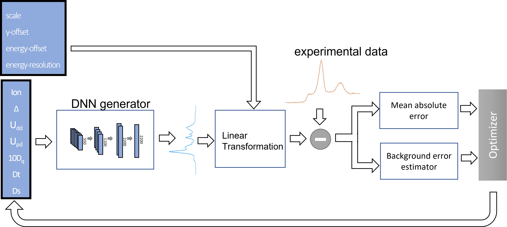

# Deep Neural Networ for XPS

This repository hosts the source code for a proof-of-concept algorithm that employs DNN to extract information of x-ray photoemission spectra using a fit procedure.
This algorithm is part of a large project which aims the correlation of XPS and EELS spectra for the study of supercapacitors.




## Running application

To run this algorithm you need to install Docker: https://docs.docker.com/get-docker/ .

After docker is installed run the command:

```
docker-compose up

```

Open the browser and type `http://localhost:8889/notebooks/DNN4XPS.ipynb#`


## Building yor own docker images

If you want to modify the source code and run it, use:

```
docker-compose -f docker-compose-dev.yml up

```


## Acknowledgements
This work was supported by  Sächsisches Staatsministerium für Wissenschaft und Kunst (HYSUCAP 100478697).

Link: [HYSUCAP](https://www.era-learn.eu/network-information/networks/m-era-net-2/m-era-net-call-2019/synthesis-and-characterization-of-novel-2d-hybrid-materials-for-supercapacitors)


## Contributing

Help to improve this package.

## Authors 

*   C. E. Viol Barbosa


## License

This project is licensed under the Apache License
